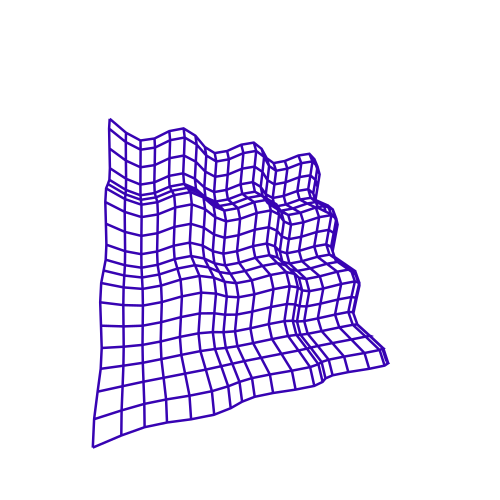

<h1>Pedro Maciel Xavier</h1>

  
<h2> 
  Saudações 👽  
</h2>

  

 
  Meu nome é Pedro, sou do Brasil, mais especificamente de Petrópolis-RJ, e aqui você encontra todos os meus projetos de programação.
  Concluí, na <strong>UFRJ</strong>, a graduação em <strong>Engenharia de Computação e Informação</strong> e também o <strong>Bacharelado em Matemática</strong>.
  Atualmente, sou pesquisador e desenvolvedor na <strong><a href="https://www.psr-inc.com/">PSR</a></strong>, além de aluno de mestrado da linha de otimização do <strong>PESC/COPPE</strong>.

  Como você pode imaginar, tenho interesse em diversos tópicos de pesquisa relacionados a Matemática e suas aplicações, até mesmo naqueles que se aplicam a temas puramente teóricos.
  Problemas cuja solução demanda alguma implementação malandra tem um lugar especial no meu coração.
  Dediquei a maior parte do meu tempo de graduação estudando <strong>Lógica</strong>, <strong>Compiladores</strong>, <strong>Otimização</strong>, <strong>Computação Gráfica</strong>, <strong>Inteligência Artificial</strong> e <strong>Computação Quântica</strong>.

  

  Além disso, já estive em outras aventuras como quando desenvolvi sistemas para pesquisa em <Strong>Saúde Pública</strong> na <strong>FIOCRUZ</strong>   ou também trabalhando com <strong>Design Generativo</strong> na <strong>FAU-UFRJ</strong>.

  

  <h2>
    Hello there 👽  
  </h2>

  

  
 
    My name is Pedro, I'm from Brasil, and here you can find all my programming projects.
    I completed my B.Sc. studies in <strong>Computer and Information Engineering</strong> and <strong>Pure Mathematics</strong> as a <strong>double-major</strong> at <strong>UFRJ</strong>.
    Currently a researcher and developer at <strong><a href="https://www.psr-inc.com/">PSR Energy</a></strong> and also a M.Sc. student at <strong>PESC/COPPE</strong> in optimization.
  

  

    As you might wonder, I'm intersted in many research topics concerning Maths and it's applications, even those which apply to pure theoretical fields.
    Specially passionate for problems and solutions whose behavior calls for some intricate computer implementation.
    Dedicated most of my graduation time studying <strong>Logic</strong>, <strong>Compilers</strong>, <strong>Optimization</strong>, <strong>Computer Graphics</strong>, <strong>Artificial Intelligence</strong> and <strong>Quantum Computing</strong>.
  

  

    Apart from that, I've been into other adventures such as <strong>Public Health Care</strong> management systems at <strong>FIOCRUZ</strong>  and <strong>Generative Design</strong> in architecture at <strong>FAU-UFRJ</strong>.
  

 

 

  

